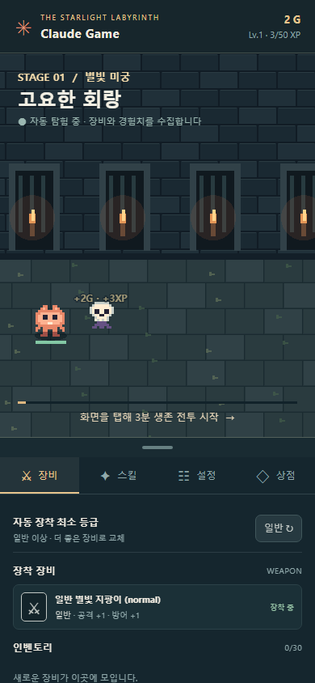
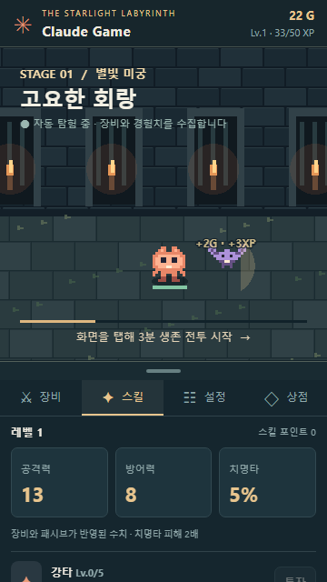
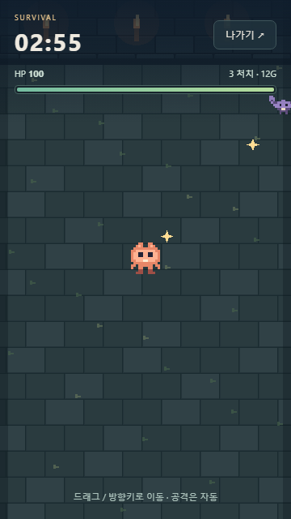
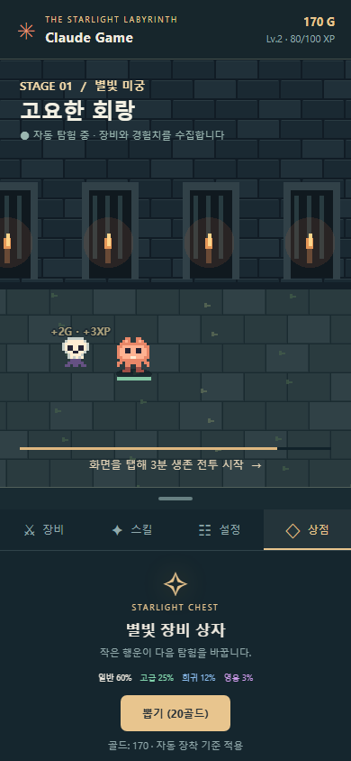

# Claude Game MVP 구현 및 반복 시각 검증

대상: https://www.fungood.co.kr/claude_game/

최초 [설계](../../superpowers/specs/2026-10-02-idle-vampire-hybrid-game-design.md)와 후속 확정 보완 요구를 기준으로 구현했다. [이전 검증](visual-review.md)의 미구현 판정은 수정 전 상태다.

## 구현 내용

| 요구 | 구현 및 검증 |
|---|---|
| 픽셀 캐릭터·횡스크롤 방치 전투 | 픽셀 마스코트, 슬라임·박쥐·해골, 미궁 타일·횃불 배경, 좌우 자동 이동과 배경 이동, 공격 이펙트·드롭 표시 |
| 실제 3분 생존 전투 | 적 생성·추적, 자동 투사체, 명중·접촉 피해·무적 시간, 치명타, 장비/스킬 공격력·방어력 반영, 회복 |
| 전투 조작과 HUD | 터치 드래그 조이스틱, 방향키, 경계 제한, 타이머·체력바·처치/골드 표시, 나가기 |
| 전투 결과 | 성공·사망·귀환·재접속 결과 화면. 처치 보상과 클리어 추가 보상. 아이템 자동 장착/인벤토리/초과 골드 환산 |
| 모바일 레이아웃 | 화면 높이에 맞는 canvas, 하단 관리 영역 약 36~38%, 접기/펼치기, 전투 때 게임 영역 전체 사용 |
| 장비/인벤토리 | 장착품, 30칸 보관 목록, 수동 장착, 등급·공격/방어 표시, 자동 장착 최소 등급 |
| 스크랩북 | 교체품 보관·골드 복원·즉시 재장착 |
| 스킬/스탯 | 강타·철갑 투자, 최대 단계/포인트 검사, 장비·패시브 반영 공격/방어/치명 표시 |
| 설정 | 실제 사운드 효과 켜기/끄기, 게임 내 획득 알림, 방치 자동 진행 켜기/끄기 |
| 상점 | 20골드 가챠, 4등급 확률 표시, 획득 장비와 자동 장착/인벤토리/환산 결과 안내 |
| 저장/복구 | 5초 자동 저장, 페이지 이탈·백그라운드 저장, 전투 진입 스냅샷과 처치 보상 저장, 재접속 정산 1회 보장, 구형 세이브 필드 보충 |
| 포털 연동 | 기존 Claude Game 카드의 iframe에서 새 배포 게임을 실행 |

룬워드·큐빙·감정·저주/오라·보스 전용 패턴·경매장·심화 스킬트리는 원래 설계에서 2차 이후로 미룬 항목이므로 이번 완료 범위에 포함하지 않는다.

## 검증과 수정 반복

1. 수정 전 배포 화면에서 빈 전투, 강제 HP 감소, 모바일 패널 소실, 누락 UI를 재현했다.
2. 전투/상태/저장 모듈과 픽셀 장면, 관리 UI를 구현한 뒤 첫 시각 검증을 진행했다.
3. 뽑기 결과 피드백과 패널 드래그를 보완했다.
4. 별도 테스트 저장본으로 스킬 투자, 장착, 복원, 가챠, 설정, 저장 복구를 확인했다. 새 캐릭터로 별도 실제 180초 생존 검증을 수행했다.
5. 패널 접기 후 펼칠 때 Phaser 내부 크기가 이전 높이로 남는 문제를 발견했다. 부모 크기를 갱신하도록 수정하고 재검증했다.
6. 테스트/빌드를 통과한 산출물을 게임 자체 Pages와 fungood 도메인의 `/claude_game/` 경로에 게시했다. 최종 배포 검증 결과는 아래 production/results.json에 기록한다.

## 확인 결과

- **단위 테스트 84개 통과**, 프로덕션 빌드 성공, diff 공백 검사 통과.
- **320×568, 360×640, 390×844, 430×932, 1440×900** 화면 검사.
- 터치 드래그 최소화 및 탭 확장, 전투 연속 진입·귀환 3회 확인.
- 전투 중 새로고침 후 획득 보상 정산과 다시 새로고침했을 때 중복 지급되지 않음을 확인.
- 실패 경로는 적 접촉/HP 테스트 조건을 구성해 확인했다. 일반 플레이의 클리어 경로와 구분했다.
- **새 캐릭터로 시간 단축 없이 180초 동안 터치 이동하여 생존 성공**. 해당 실행에서 143마리 처치, 결과 표시 672G / 790XP / 장비 37개. 장비 가방 초과분은 환산되므로 지갑의 최종 증가량과 결과의 처치 골드 합계는 다를 수 있다.
- 전체 수용 시나리오에서 JavaScript 예외 0건.
- 검증은 Chromium 브라우저의 모바일 에뮬레이션이다. 실제 iPhone/Safari 하드웨어에서의 터치·오디오 출력은 별도 실기기 검증 범위다.

## 화면 증거

## 재현 자료

- [수용 시나리오 결과](acceptance/results.json)
- [최종 배포 검증 결과](production/results.json)
- `tests/visual-implementation.cjs`: 반복 UI/전환 캡처
- `tests/visual-acceptance.cjs`: 데이터 경계·복구·실제 3분 터치 생존
- `tests/visual-production.cjs`: 실제 도메인과 포털 iframe 검증
- 시각 검증 스크립트는 설치된 Playwright 모듈을 사용한다. 다른 환경에서는 `PLAYWRIGHT_MODULE`을 해당 playwright-core 경로로 지정한다. 별도 브라우저 컨텍스트를 사용하므로 사용자 세이브를 바꾸지 않는다.

배포 산출물: `assets/index-mwaI4NqG.js`, `assets/index-C74frdhJ.css`.
게임 배포 커밋: `eeae92d550df82495f79c4fad36f35bd91b7fb93`.
도메인 배포 커밋: `f6b6c1c820489c0191cc3ae374cefded0d2b9b52`.
