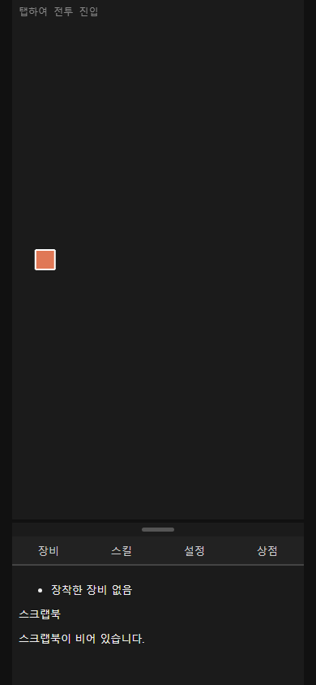
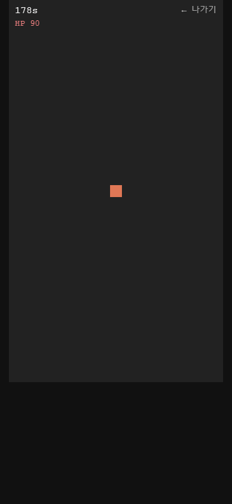
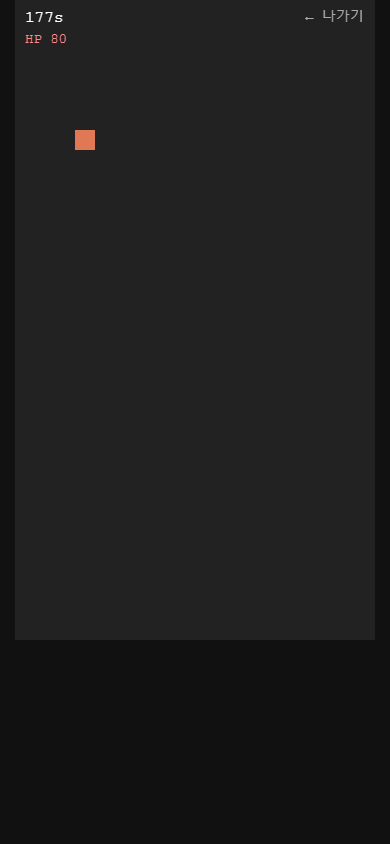
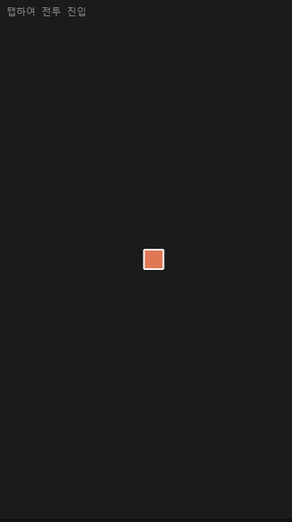
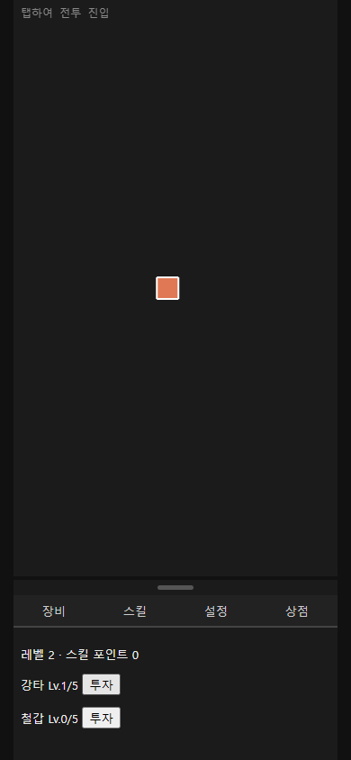
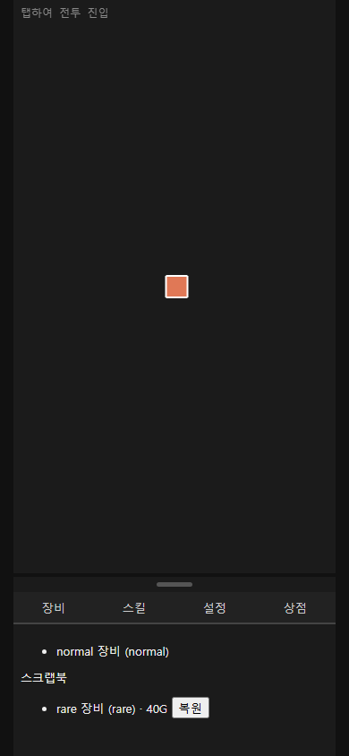

# Claude Game 설계 대비 시각 검증

> 아래는 수정 전 기록이다. 후속 구현과 재검증 결과는 [완료 보고서](completion-review.md)를 참고한다.

검증일: 2026-10-03. 대상: https://www.fungood.co.kr/claude_game/ 및 포털 카드 → 플레이 경로.

**판정: 설계 전체 구현 완료가 아니다. 관리 기능 일부가 동작하는 프로토타입이며, 핵심 전투·비주얼·모바일 레이아웃이 미완성이다.**

## 방법과 범위

- 최초 [설계](../../superpowers/specs/2026-10-02-idle-vampire-hybrid-game-design.md), [구현 계획](../../superpowers/plans/2026-10-02-idle-vampire-hybrid-game.md), [후속 보완 계획](../../superpowers/plans/2026-10-02-idle-vampire-hybrid-game-fixes.md)을 현행 소스 및 배포 화면과 비교했다.
- 별도 Chromium 세션에서 390×844 모바일, 360×640 소형 모바일, 1440×900 화면을 검사했다. 기존 사용자 저장 데이터는 사용하거나 수정하지 않았다.
- 실제 클릭·탭·드래그·새로고침으로 확인했다. 테스트용 재화 주입이나 게임 코드 변경은 하지 않았다.
- Orca 브라우저는 runtime_unavailable 오류로 캡처하지 못해 독립 Playwright 브라우저로 검증했다.
- 실제 iPhone/Safari 기기 검증은 수행하지 않았다. 브라우저 에뮬레이션 결과다.
- 첫 검증에서 JavaScript 예외 및 실패 요청은 0건이었다. 이는 설계 충족을 의미하지 않는다.

## 주요 결함

| 우선순위 | 발견 사항 | 근거 및 영향 |
|---|---|---|
| P0 | 생존 전투에 적·자동 공격·충돌 판정이 없음 | 화면에 주황색 사각형만 있고 HP가 90→80으로 감소한다. CombatScene은 적과 무관하게 800ms마다 피해를 준다. 이동해도 피할 수 없다. |
| P0 | 정상 플레이로 3분 생존 클리어 불가능 | 초기 HP 100, 최소 피해 1/800ms, 회복 없음. 코드상 방어력이 아무리 높아도 최대 약 80초 안에 사망한다. 기본 상태에서는 약 16초 만에 방치 화면으로 복귀했다. 목표 시간은 180초다. |
| P1 | 모바일 관리 UI 소실 | 360×640에서 canvas 높이가 640px로 고정되고 패널 y=644, 높이=0이 된다. 장비·스킬·설정·상점 탭이 보이지 않는다. |
| P1 | 픽셀 캐릭터·횡스크롤 맵·몬스터 전투 연출 없음 | 방치 화면은 단색 배경과 사각형이다. 이동/재화 증가 수식은 있지만 설계된 시각적 게임 장면이 없다. |
| P1 | 전투 전체화면 전환 미완성 | 하단 패널만 숨긴다. 390×844에서도 canvas는 360×640으로 유지되어 아래 약 204px가 빈 공간이다. |
| P1 | 인벤토리와 기본 능력치 UI 누락 | 저장 데이터에는 미장착 아이템이 20개 있지만 장비 탭은 장착품·스크랩북만 보여준다. 스킬 탭에도 공격력·방어력·치명 수치가 없다. |
| P1 | 전투 중 저장·복귀 정산 미구현 | 전투 중 새로고침하면 방치로 돌아오지만 저장된 mode는 idle, combatTimer는 0이며 전투 세션/획득 보상 스냅샷이 없다. 최초 설계의 중도 실패·획득분 정산과 다르다. |
| P1 | 패널 드래그 최소화 재현 실패 | 핸들을 아래로 40px 드래그한 마우스 및 터치 입력 모두 minimized=false. 핸들 자체의 pointerup에만 의존하며 이동 후 종료 처리가 안정적이지 않다. |
| P2 | 설정 범위 축소 | 자동 장착 등급만 변경 가능하다. 최초 설계의 사운드·알림·자동 진행 on/off는 없다. 후속 계획도 이 설정 전체를 복원하지 않았다. |
| P2 | 뽑기 결과 피드백 부족 | 40→20골드 차감은 확인했지만 결과 아이템 안내가 없다. 미장착 결과는 인벤토리 목록도 없어 사용자가 확인할 수 없다. |

주요 코드: `src/scenes/CombatScene.js:13`, `src/scenes/CombatScene.js:50`, `src/main.js:30`, `src/style.css:12`, `src/ui/BottomPanel.js:11`, `src/ui/BottomPanel.js:127`, `src/systems/survivalCombat.js:25`.

## 요구사항별 판정

| 설계/보완 요구 | 판정 | 확인 내용 |
|---|---|---|
| 픽셀 마스코트와 횡스크롤 맵 | 미구현 | 사각형과 단색 배경 |
| 방치 자동 이동·스테이지 진행 | 부분 구현 | 진행 수식과 이동은 있음. 좌우 왕복 대신 오른쪽 진행 후 시작점으로 되돌아가는 구조 |
| 방치 경험치·골드·드롭 | 동작 확인 | 레벨 2, 스킬 포인트 1, 골드·아이템 자동 증가 |
| 액션 영역 탭으로 전투 진입 | 동작 확인 | 전투 화면으로 전환 |
| 적 생성·자동 공격·생존 플레이 | 미구현 | 시간 기반 강제 피해만 존재 |
| 타이머·HP·나가기 | 부분 구현 | 숫자 타이머와 HP, 나가기 동작. 설계의 체력바 없음 |
| 이동 조작 | 부분 검증 | 포인터 드래그 전후 캐릭터 위치 변경 확인. 실제 모바일 기기 및 장시간 키보드 경계 처리는 미검증 |
| 전투 클리어/중도 보상 | 미완성 | 클리어 보상 코드만 존재. 현재 구조상 클리어 불가능하며 처치 보상 생성도 없음 |
| 하단 4개 탭 | 부분 구현 | 390×844에서 작동, 360×640에서 패널 소실 |
| 아이템 4등급·자동 장착 | 구현 확인 | 코드에 4등급 확률/비교 로직. 실플레이에서 장비 획득·교체 확인. 확률 분포 실측은 하지 않음 |
| 인벤토리 초과 골드 환산 | 코드상 구현 | 저장 인벤토리는 있음. 이번 UI 검증에서 가득 찬 상태의 환산까지 재현하지 않음 |
| 패시브 2개·레벨업·포인트 투자 | 동작 확인 | 강타 Lv.0→1, 포인트 1→0. 철갑도 목록에 표시 |
| 장비/스킬 효과의 양쪽 모드 반영 | 부분 구현 | 방치에는 공격력 기반 틱 단축, 생존에는 방어력 기반 피해 경감. 생존 공격력·치명 활용 없음 |
| 사운드·알림·자동 진행 옵션 | 미구현 | 등급 변경만 제공 |
| 상점 가챠 | 동작 확인/UX 미완성 | 20골드 차감, 결과 안내 없음 |
| 스크랩북 복원 | 동작 확인 | normal 복원 후 장착되고 기존 rare가 스크랩북으로 이동 |
| 패널 드래그 최소화 | 결함 재현 | 마우스/터치 모두 최소화 실패 |
| 일반 저장/불러오기 | 동작 확인 | 새로고침 후 강타 Lv.1과 설정·장비 유지 |
| 전투 이탈 스냅샷·정산 | 미구현 | 저장 데이터에 진행 중 전투 기록 없음 |
| 포털 카드 → 게임 | 동작 확인 | Claude Game 카드와 iframe의 /claude_game/ 로딩 확인 |

룬워드·큐빙·감정·저주/오라·보스 패턴·경매장·심화 스킬트리는 문서에서 후속 범위로 미뤘으므로 결함 목록에서 제외했다. 상점은 초기 보완 계획에서 이연했지만 후속 Task 24가 가챠를 다시 포함하므로 최종 요구에 포함했다.

구현 계획 자체가 사각형 캐릭터와 임시 피해 루프를 제시한 부분도 있다. 따라서 계획의 코드 조각을 구현했다는 사실만으로 최초 게임 설계를 충족했다고 판단할 수 없다.

## 화면 증거

### 방치 화면: 캐릭터·맵 대신 사각형

### 생존 전투: 적 없이 HP 감소, 아래 빈 공간

### 360×640: 관리 탭 소실

### 동작하는 관리 기능 및 포털 카드

전체 측정값: [results.json](results.json), [후속 탭·드래그·새로고침 확인](followup.json). 저장 데이터는 각 시점의 마지막 자동 저장본이므로 화면의 실시간 값과 최대 10초 차이가 날 수 있다.

이번 작업은 검증만 수행했다. 게임 구현이나 배포 파일은 수정하지 않았다. 우선 수정 순서는 실제 적/공격/생존 루프 → 모바일 레이아웃 → 캐릭터·맵 표현 → 인벤토리·능력치 UI → 저장/정산·드래그 처리다.
